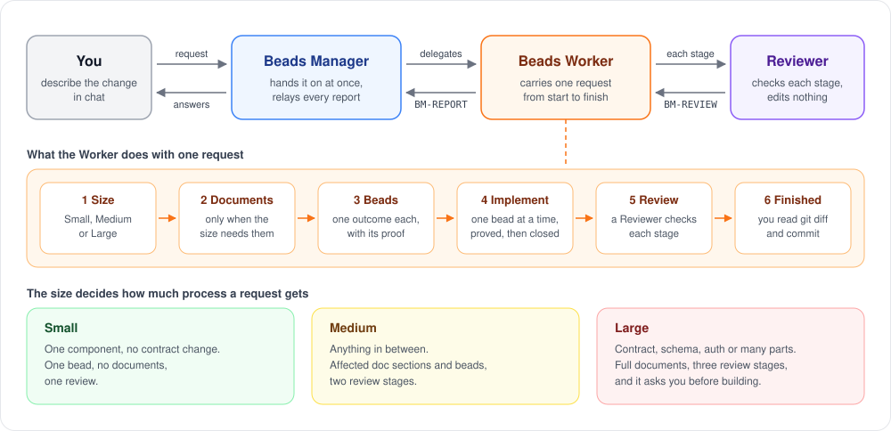

# paseo-bm — Beads Management for Paseo

`paseo-bm` adds a small agent team to [Paseo](https://paseo.sh). You describe a change in chat, and the team turns it into documents (only when the change needs them), beads (small, dependency-aware work items tracked with `br`) and working code. A separate agent reviews each stage.



- **Beads Manager** — your single point of contact in a workspace. It hands each request to a Worker right away and tells you the result.
- **Beads Worker** — carries one request from start to finish with the feature-workflow skills from [cuongntr/agent-skills](https://github.com/cuongntr/agent-skills) (another author's repository). Anything beyond your request becomes a suggestion, not work.
- **Reviewer** — checks each stage and returns a verdict. It never edits anything.
- **Screens in Paseo** — **Metric** (what each request did and cost), **Beads** (the workspace's beads) and **Setup** (tools, skills and your own role instructions).

> **Status:** prerelease (`0.2.0-alpha.*`). Command names, flags, exit codes and the `--json` shape are a public contract, but expect rough edges.

## Quick start

1. Open the Paseo app so its daemon is running. You need Paseo 0.8.0 or newer with the `paseo` CLI on your PATH, Node 22 or newer, and macOS or Linux.
2. In a terminal, run the installer and answer its questions:

   ```bash
   npx paseo-bm
   ```

3. Open **Beads Manager** in Paseo's sidebar, press **Go to** next to your workspace, and describe the change you want.

> **Run it, don't add it as a dependency.** `paseo-bm` is a command-line tool you run with `npx`. `npm i paseo-bm` only adds a useless dependency to your project.

## Before you install

- **Paseo plugins run without a sandbox.** The plugin has the same access to your machine as the Paseo daemon: files, processes, credentials and network.
- **One consent grants Paseo's agent tools to every agent on this machine**, not only to paseo-bm's roles. Any agent can then create, prompt and stop other agents, and spend money on your model providers.
- **The Worker runs without permission prompts.** Its limits (no commit or push, no destructive commands, no secret files) are role instructions only, so review `git diff` before you commit.

The full warnings, including what paseo-bm records on your machine, are in [GUIDE.md](GUIDE.md#before-you-install-read-these-warnings).

## Documentation

- **Guided tour:** [paseo-bm.erai.pro](https://paseo-bm.erai.pro)
- **Full reference:** [GUIDE.md](GUIDE.md) — requirements, install options, working with the agents, the screens, everything paseo-bm writes, agent skills, `doctor`, updating, uninstalling, commands, exit codes and troubleshooting.

## License

MIT, as declared in `package.json`.
