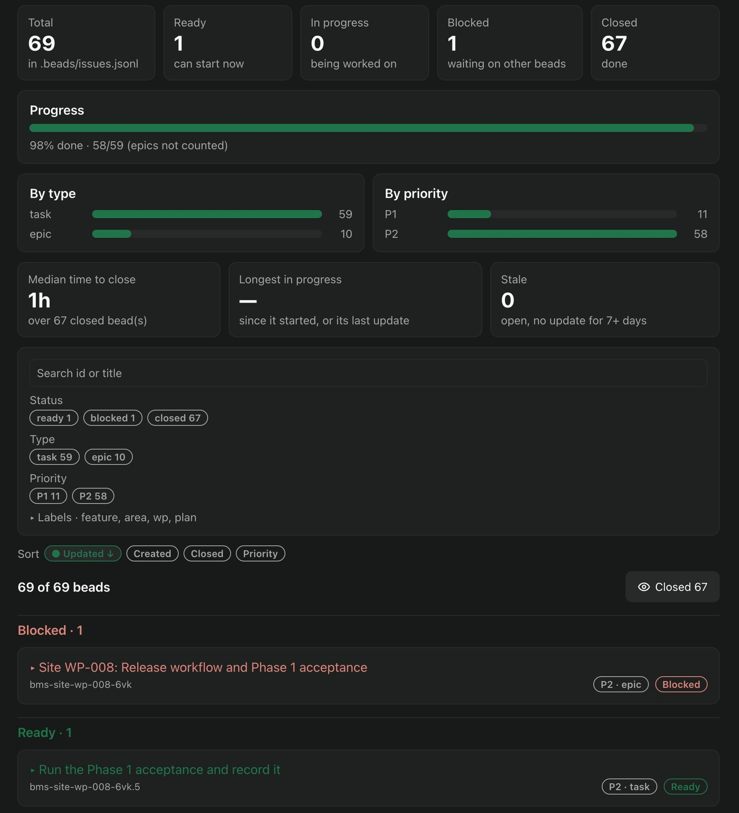

# paseo-bm-plugin — Beads Management for Paseo

This package **is** paseo-bm: a small agent team for [Paseo](https://paseo.sh) plus the screens it
contributes. You describe a change in chat; a **Beads Manager** hands it to a **Beads Worker**, which
turns it into documents (only where the change needs them), beads and working code, with a
**Reviewer** checking each batch. Loading it gives you **Metric** (what each request did and cost),
**Beads** (the workspace's beads) and **Setup** (roles, tools, skills and role instructions).



## Install

Needs **Paseo 0.9.0 or newer**. Install it from [paseo.cafe](https://paseo.cafe), or:

```bash
paseo plugin add npm:paseo-bm-plugin
```

Then open **Beads Manager** in Paseo's sidebar. The plugin creates its three agent roles
(`bm-manager`, `bm-worker`, `bm-reviewer`) the first time you open it, with the first provider and
model Paseo reports as available; change them in **Setup → Agents**.

Open **Setup** and work through **Set up paseo-bm**. Three steps need a press, because each grants
something: **Allow agent tools** (Paseo's machine-wide `daemon.mcp.injectIntoAgents` switch, without
which the Manager cannot create a Worker), **Install skills** (runs the third-party `skills` CLI
once) and **Install `br` / `bv`** (the beads tools).

Update it with `paseo plugin update paseo-bm`.

## Removing it

Open **Setup**, press **Remove paseo-bm's settings…** and confirm, **then**:

```bash
paseo plugin remove paseo-bm
```

Paseo has no hook that runs when a plugin is removed, so the button is what takes paseo-bm's entries
out of your configuration and puts the agent-tools switch back. Removing the plugin without pressing
it leaves those entries behind. Your history and settings are kept unless you confirm a second time.

## If you installed paseo-bm with `npx paseo-bm` before

You have a **directory install**. It never updates by itself, and installing this package on top of
it is refused by Paseo with exactly:

```
Plugin ID "paseo-bm" is already configured; choose another ID with --id
```

Do **not** choose another id: two copies of paseo-bm would both create roles and both inject
instructions. Run this once instead — it switches your install to this package and keeps your roles,
settings and history:

```bash
npx paseo-bm@0.4.0
```

## Before you install

Paseo plugins run **without a sandbox**: this plugin has the same access to your machine as the
Paseo daemon. The agent-tools switch applies to **every agent on this machine**, not only to
paseo-bm's roles. The Worker runs without permission prompts, so review `git diff` before you commit.
The **Install skills** button runs a third-party tool that downloads from
[cuongntr/agent-skills](https://github.com/cuongntr/agent-skills) (another author's repository);
paseo-bm never writes to your skills folders itself. The full list of what paseo-bm records on your
machine is in
[GUIDE.md](https://github.com/hieunt286/paseo-bm/blob/main/GUIDE.md#before-you-install-read-these-warnings).

## If the plugin does not load

Check `paseo plugin ls` and `paseo plugin logs paseo-bm`.

## Documentation

- [Repository and README](https://github.com/hieunt286/paseo-bm#readme)
- [GUIDE.md](https://github.com/hieunt286/paseo-bm/blob/main/GUIDE.md) — requirements, the screens, everything paseo-bm writes, updating, removal, migration, troubleshooting
- [Guided tour](https://paseo-bm.erai.pro)

## License

MIT, see [LICENSE](LICENSE).
