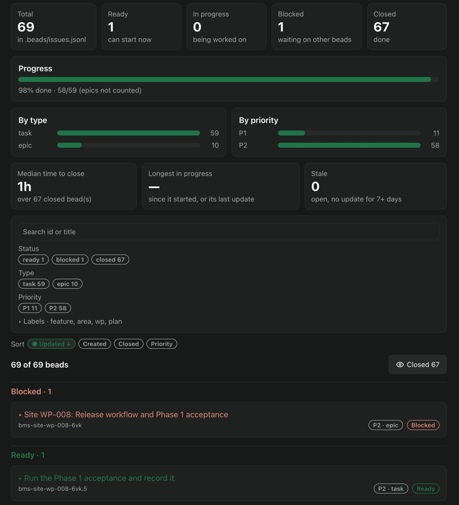

# paseo-bm-plugin — Beads Management for Paseo

This package **is** paseo-bm: a small agent team for [Paseo](https://paseo.sh) plus the screens it
contributes. You describe a change in chat; a **Beads Manager** hands it to a **Beads Worker**, which
turns it into documents (only where the change needs them), beads and working code, with a
**Reviewer** checking each batch. Loading it gives you the **Beads Manager** surface: an **Inbox**
(the decisions that need you, and alerts), **Work** (each project's requests with their stage and
timeline, its beads board and its agents), **Insights** (flow, cost and beads figures) and
**Settings** (roles and models, which decisions the agents may take for you, tools and skills,
your data). A workspace's **Beads** tab shows that project's page.

**Beads Orchestrator** is one agent for the whole machine, in a workspace of its own, that you start
from the **Inbox** when you want it, and talk to in its chat. It reads the work of every paseo-bm
project and tells each project's Manager what to do next, speaking as you. When something needs your
decision it asks you in the Inbox, each option with what it would allow and often the command ready
on it; picking the option sends that command once. It sends a command by itself only right after you
tell it to in its chat, or where your autonomy policy (**Settings → Autonomy**) delegates, in that
project, every kind of decision the command touches; a new install delegates nothing. It leaves every
Worker's question to you, except the kinds your policy delegates to it. paseo-bm watches the running Workers of every project (stuck, waiting on a
permission, running a dangerous command, failing the same command, piling process onto a small
request, writing outside the project); in a project where a kind of decision is Shadow or Delegated,
those signals wake the Orchestrator, which can then correct a Worker directly within that authority,
always with a copy to its Manager. Every command declares what it allows; a push, publish, deploy,
real-data, migration, security or cost change needs a decision you answered, whatever your policy.
It can check a report with read-only git in the project and keeps short notes per project. It uses tokens on its provider, and nothing of it exists until you start it.



## Install

Needs **Paseo 0.9.0 or newer**. Install it from [paseo.cafe](https://paseo.cafe), or:

```bash
paseo plugin add npm:paseo-bm-plugin
```

Then open **Beads Manager** in Paseo's sidebar. The plugin creates its four agent roles
(`bm-manager`, `bm-worker`, `bm-reviewer`, `bm-orchestrator`) the first time you open it, with the first provider and
model Paseo reports as available; change them in **Settings → Agents**.

Open **Settings**. Three things need a press, because each grants something: **Allow agent tools**
(Paseo's machine-wide `daemon.mcp.injectIntoAgents` switch, without which Beads Manager does not
start, because a Manager started earlier could never create a Worker), **Install skills** (runs the
third-party `skills` CLI once) and **Install `br` / `bv`** (the beads tools).

Update it with `paseo plugin update paseo-bm`.

## Removing it

Open **Settings → Data**, press **Remove paseo-bm's settings…** and confirm, **then**:

```bash
paseo plugin remove paseo-bm
```

Paseo has no hook that runs when a plugin is removed, so the button is what takes paseo-bm's entries
out of your configuration and puts the agent-tools switch back. Removing the plugin without pressing
it leaves those entries behind. Your history and settings are kept unless you confirm a second time.
The Beads Orchestrator agent and its `home` workspace, if you started it, stay in Paseo until you
archive and remove them.

## If you installed paseo-bm with `npx paseo-bm` before

You have a **directory install**. It never updates by itself, and installing this package on top of
it is refused by Paseo with exactly:

```
Plugin ID "paseo-bm" is already configured; choose another ID with --id
```

Do **not** choose another id: two copies of paseo-bm would both create roles and both inject
instructions. Run this once instead — it switches your install to this package and keeps your roles,
settings and history:

```bash
npx paseo-bm@0.4.0
```

## Before you install

Paseo plugins run **without a sandbox**: this plugin has the same access to your machine as the
Paseo daemon. The agent-tools switch applies to **every agent on this machine**, not only to
paseo-bm's roles. The Worker runs without permission prompts, so review `git diff` before you commit.
The **Install skills** button runs a third-party tool that downloads from
[cuongntr/agent-skills](https://github.com/cuongntr/agent-skills) (another author's repository);
paseo-bm never writes to your skills folders itself. The Orchestrator, once you start it, sends the
masked content of every paseo-bm project to its provider, and a command you approve — by picking an
option, by telling it to send in its chat, or one it sends by itself where your autonomy policy
delegates what the command does, to the Manager or directly to a Worker with a copy to its Manager —
reaches the agent as your own word. The full list of what paseo-bm records on your
machine is in
[GUIDE.md](https://github.com/hieunt286/paseo-bm/blob/main/GUIDE.md#before-you-install-read-these-warnings).

## If the plugin does not load

Check `paseo plugin ls` and `paseo plugin logs paseo-bm`.

## Documentation

- [Repository and README](https://github.com/hieunt286/paseo-bm#readme)
- [GUIDE.md](https://github.com/hieunt286/paseo-bm/blob/main/GUIDE.md) — requirements, the Inbox, Work, Insights and Settings, everything paseo-bm writes, updating, removal, migration, troubleshooting
- [Guided tour](https://paseo-bm.erai.pro)

## License

MIT, see [LICENSE](LICENSE).
